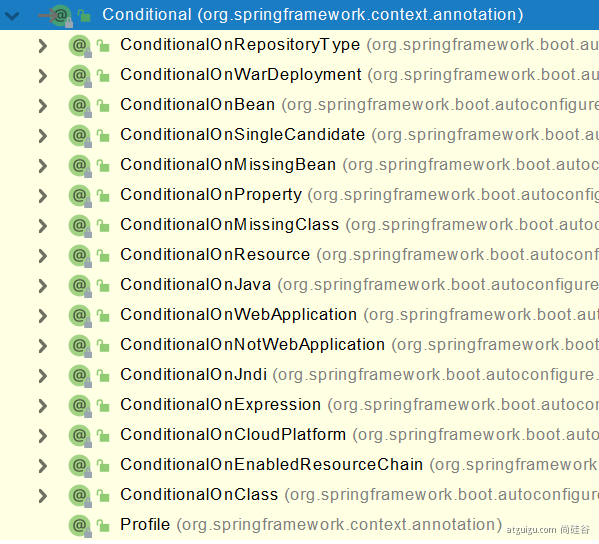

# 02-configuration

## @Configuration

首先在boot文件夹下创建config子包，新建Config类，为类添加此注解，
告诉SpringBoot这是一个配置bean的类。

类中方法名即实例名称，返回类型是bean类型，返回值是bean的值

配置类本身也是组件
```java
MyConfig bean = run.getBean(MyConfig.class);
System.out.println(bean);
```

> 在这个注解中包含一个proxyBeanMethods()属性，默认为true。
> 此时配置类的是CGLIB代理对象
> 
> 我们在main中调用Config类型中的方法，新建的任何实例化对象都是单实例，
> 都是在容器中找。
> 
> 若我们把这个属性设置成false，配置类就不是单实例。

### proxyBeanMethods

1. 配置类组件与组件的关系仅仅是简单调用，设置为false模式
2. 配置类中若组件间是相互依赖的，设置为true模式

## @Bean()

告诉容器这个方法是创建对象的方法。

若不想以新建的方法名为实例名，可向@Bean注解传入你想要的实例名。

比如我想将他起名为user01

```java
@Bean(value="user01")
```

## @Import()

通过Import注解额外传入想要创建的实例。传入的是类型的枚举。

例如

```java
@Import({Student.class, User.class})
```

## @Conditional

按条件装配。是一个根注解，下面派生了很多子注解。



### @ConditionalOnBean

当容器中出现xxx名的组件才会创建以这个注解标注的类。

```java
@ConditionalOnBean(name="xxx")
```

## @ImportResource

Spring用xml配置文件注入的方式添加的bean在SpringBoot中会失效，
在迁移老框架的bean的时候可以在配置类加上这个注解使配置文件生效

```java
@ImportReource("classpath:applicationContext.xml")
```

## 

