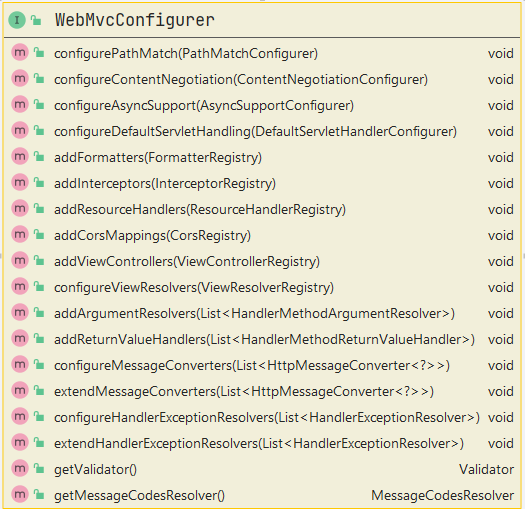

# Dashboard项目

首先贴上[Spring官方文档](https://docs.spring.io/spring-boot/docs/current/reference/htmlsingle/)

## Thymeleaf

通过pom文件加载thymeleaf依赖

```xml
<dependency>
    <groupId>org.springframework.boot</groupId>
    <artifactId>spring-boot-starter-thymeleaf</artifactId>
</dependency>
```

在html头中加载命名空间。

```html
<html lang="en" xmlns:th="https://www.thymeleaf.org">
```

原则上Thymeleaf可以接管html所有的原生标签，关于thymeleaf的语法可以参考下面链接

[官方文档](https://www.thymeleaf.org/doc/tutorials/3.0/usingthymeleaf.html)

[中文速查](https://fanlychie.github.io/post/thymeleaf.html)


## 自定义MVC配置

这个配置的内容有很多，一般建在`**/config/`包下，我这边命名为`MyMvcConfig.java`

根据官方文档要求，必须要继承`WebMvcConfigurer`接口类。

以下就是官方原文

> **Spring MVC Auto-configuration**
> 
> Spring Boot provides auto-configuration for Spring MVC that works well with most applications.
> 
> The auto-configuration adds the following features on top of Spring’s defaults:
> 
> * Inclusion of `ContentNegotiatingViewResolver` and `BeanNameViewResolver` beans.
> 
> * Support for serving static resources, including support for WebJars (covered later in this document)).
> 
> * Automatic registration of `Converter`, `GenericConverter`, and `Formatter` beans.
> 
> * Support for `HttpMessageConverters` (covered later in this document).
> 
> * Automatic registration of `MessageCodesResolver` (covered later in this document).
> 
> * Static `index.html` support.
> 
> * Automatic use of a `ConfigurableWebBindingInitializer` bean (covered later in this document).
> 
> If you want to keep those Spring Boot MVC customizations and make more MVC customizations (interceptors, formatters,
> view controllers, and other features), you can add your own `@Configuration` class of type `WebMvcConfigurer` but **without** `@EnableWebMvc`.
> 
> If you want to provide custom instances of `RequestMappingHandlerMapping`, `RequestMappingHandlerAdapter`, or 
> `ExceptionHandlerExceptionResolver`, and still keep the Spring Boot MVC customizations, you can declare a bean of type `WebMvcRegistrations` and use it to provide custom instances of those components.
> 
> If you want to take complete control of Spring MVC, you can add your own `@Configuration` annotated with 
> `@EnableWebMvc`, or alternatively add your own `@Configuration`-annotated `DelegatingWebMvcConfiguration` as described in the Javadoc of `@EnableWebMvc`.


实际上我们继承了这个接口类，我们就会发现我们有许多方法可以重写。



看名字就知道了。

这里我们先定义视图解析器，重写`addViewControllers`方法，为提供的参数添加。

```java
public void addViewControllers(ViewControllerRegistry registry){
    registry.addViewController("/").setViewName("index");
}
```

例如这个，就是为`/`请求跳转到index.html中。

> **这里提一个问题：为什么是index会跳转到index.html？**
> 
> 这其实是一个对源码阅读能力的考验，正好以此为例子。
> 
> 用过SpringMVC的都应该知道，我们在MVC.xml中配置过视图解析器，比如：
>
> ```xml
> <!-- 视图解析器对象 -->
> <bean id="internalResourceViewResolver" class="org.springframework.web.servlet.view.InternalResourceViewResolver">
>     <property name="prefix" value="/WEB-INF/pages/"/>
>     <property name="suffix" value=".jsp"/>
> </bean>
> ```
> 
> 这个组件有两个属性，一个是prefix，一个是suffix。也就是前缀和后缀。
> 
> 意思就是我们之前在controller返回的String，例如xxxxx，实际上是返回了/WEB-INF/pages/xxxxx.jsp
> 
> 在Spring Boot里也一样。现在，我们在导入的依赖中寻找关于MVC的AutoConfiguration。
>
> 找到`spring-boot-autoconfigure-2.4.3.jar.org.springframework.boot.autoconfigure.web.servlet.
     > WebMvcAutoConfiguration.java`这个类，发现所谓的SUFFIX并不是.html啊，是我们错了吗？
> 
> 其实并不是，因为我们用了模板引擎thymeleaf，我们所有的视图其实是经过了thymeleaf的
> 
> 此时，我们打开ThymeleafProperties，我们就能清清楚楚的看到这个代码。
> 
> ```java
> private String prefix = "classpath:/templates/";
> private String suffix = ".html";
> ```
> 
> 即会在项目的resources目录的templates下寻找html格式的文件。
> 
> 同样的，我们可以在application.yaml中插入代码来修改这个内容。（直接输入suffix会补全）
> 
> ```yaml
> spring:
>   thymeleaf:
>     suffix:
> ```


## 页面国际化

在网站中，都有中英文切换，我以前以为是ajax实现的，其实用.properties可以实现。

1. 首先我们在resources文件夹下创建国际化文件夹`i18n`，例如我们要创建登录页面的
国际化，我们新建`login.properties`文件和`login_zh_CN.properties`文件，IDEA会
   很智能的把他们给打包起来，你就可以根据关键词添加国际化的变量了。
   
2. 国际化转换有一个关键类，叫做`MessageSourceAutoConfiguration`的类。
   打开后发现，有`@ConfigurationProperties`注解我们可以通过里面的参数用yaml进行配置。
   
3. 在thymeleaf接管的html中，添加#{}来接管国际化的内容

4. 会发现，出现了？？？？等乱码，在IDEA全局设置中，找到File Encoding，
   将所有文件编码改为UTF-8即可。
   
## 登录功能的实现

其实登录功能很简单，用传统SpringMVC的办法

1. 为登录写一个controller
2. 传入username和password参数
3. 判断是否成功

我们在Spring Boot也是这个思路。

登陆成功后会携带参数跳转到dashboard页面，我们通过跳转到一个重定向的页面
来丢弃所携带的参数（username和password）


## 展示员工列表

这一部分没什么好说的，在model中添加元素即可。

只不过要注意一下thymeleaf的each语法。

尤其是日期格式化，以后用得到。

## 新增员工

这里需要注意的就是自定义日期格式，可以使用自定义类型转换器或者配置文件。

```yaml
spring: 
  mvc:
    data-format: yyyy-MM-dd
```

## 编辑员工信息

这个没法用mapper，就先删除再增加，没有数据库的情况下，这些业务逻辑都不重要。

## 报错

再templates文件夹下创建error包，将`错误代码.html`放进去，就会自动跳转了，太方便了！